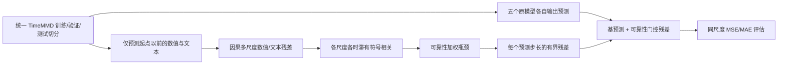

# CARMA v1：因果多尺度可靠性适配器

状态：**已下载论文代码、已实现统一插件与训练入口；未在服务器上训练，尚无 MSE/MAE 改善结论。** 这里“结果上升”解释为预测质量提高，也就是 MSE、MAE 数值下降。任何模型、领域、步长都不能事先保证双指标下降。

## 1. 要解决的问题

TimeMMD 九个领域的文本稀疏度、事件滞后和数值变化速度不同。直接拼接文本与序列会使无关文本也进入预测。固定一个时间尺度或只看同期文本，又会错过跨步长的慢变化与滞后作用。不同基模型的内部结构也不同，改动五份主干代码会使比较失去一致性。

CARMA 放在五个模型的预测输出之后，只接受相同的四项输入：基模型预测、历史数值、与历史时点对齐的文本嵌入、文本可用掩码。它预测一个**有界残差**，缺失文本时严格退化成原预测。设计借鉴三篇论文的机制，但代码为独立重写，不直接复制原实现。

## 2. 来源、实际使用与下载记录

| 论文（Excel 行号） | 官方代码与本地位置 | 固定版本 | 借鉴并迁移的思想 | 使用情况 |
|---|---|---|---|---|
| CrossLinear: Plug-and-Play Cross-Correlation Embedding for Time Series Forecasting with Exogenous Variables（265） | [官方仓库](https://github.com/mumiao2000/CrossLinear)，`sources/CrossLinear/models/CrossLinear.py` | `d22366e2f59ced560a02b2b1c7cc673e3c02a13f` | 原文用跨变量相关嵌入；这里改成**历史文本到未来数值变化的多时滞、有符号相关证据**，避免把同时相关误当成预测因果 | 1 |
| Adaptive Multi-Scale Decomposition Framework for Time Series Forecasting（255） | [官方仓库](https://github.com/TROUBADOUR000/AMD)，`sources/AMD/models/common.py` | `000d377a1ed8946aa817ff357cdf1de64b99abb9` | 原文多尺度分解与自适应融合；这里对数值与文本分别进行因果滑动均值残差，形成尺度证据 | 1 |
| DashFusion: Dual-stream Alignment with Hierarchical Bottleneck Fusion for Multimodal Sentiment Analysis（248） | [官方仓库](https://github.com/ultramarinex/DashFusion)，`sources/DashFusion/src/model/layers.py` | `37ba4177ba4be7db6ef2a8ae0ce916f2d6f99426` | 原文时间对齐和层级瓶颈融合；这里把各尺度、各时滞关系压到共享瓶颈，再生成逐预测步长的修正 | 1 |

Excel 原有两条代码链接拼写错误：CrossLinear 的账号应为 `mumiao2000`，AMD 的账号应为 `TROUBADOUR000`。已按论文官方页面核对并在 Excel 中更正。论文依据：[CrossLinear](https://arxiv.org/abs/2505.23116)、[AMD](https://arxiv.org/abs/2406.03751)、[DashFusion](https://arxiv.org/abs/2512.05515)。第三篇原任务是多模态情感分析，本文仅迁移对齐与瓶颈思想，其原任务的性能不能当成 TimeMMD 证据。

## 3. 机制与流程



1. 对历史数值按样本标准差缩放；输出修正时乘回相同标准差。基预测和历史数值必须已处于**同一数值尺度**，本插件不单独做测试集反归一化。
2. 在尺度 `1,4,12` 上，分别形成数值和文本的历史残差。滑动平均只向过去取值，文本绝不能从预测起点之后进入。
3. 对滞后 `0,1,2`，计算 `text[t-lag]` 与 `numeric[t]` 的有符号相关。每个证据同时保留两边的历史均值，避免只保留相关强度而丢失方向/水平。
4. 把尺度与时滞证据作为 token，按文本覆盖率加权，进入共享瓶颈，再按预测步长输出修正。缺失文本时门控为零。
5. 修正值限制在历史标准差的固定倍数以内；最后一层零初始化，插件初始预测与基模型完全相同。训练时对修正幅度施加惩罚。

这三种思想存在明确的前后依赖：分解得到不同动态频带，时滞相关在每个频带上估计文本作用，瓶颈才在这些候选作用中选择可信信息；不是将三个现成模块简单串联。

## 4. 插件位置与五模型接法

实现：`carma_v1/carma.py`；训练入口：`carma_v1/train_adapter.py`。对五个模型均在原模型的预测输出之后调用同一个 `CARMA.forward(base_pred, history, text, text_mask)`。`base_pred` 为 `[B,H,C]`，`history` 为 `[B,L,C]`，`text` 为 `[B,L,D]`，`text_mask` 为 `[B,L]`，输出仍为 `[B,H,C]`。

| Baseline | 原主干/统一实验位置 | 插件接入点 |
|---|---|---|
| MM-TSFlib（Informer+BERT） | `baseline/MM-TSFlib-main` | 原模型预测切片、反归一化后，指标计算前 |
| CFA（PatchTST+BERT） | `baseline/cfa-main` | 同上 |
| SpecTF（TimeMixer+GPT2） | `baseline/SpecTF-main` | 同上 |
| TaTS（iTransformer+GPT2） | `baseline/TaTS-main` | 同上；和 `TaTS-main-change-Readgpt` 的数据/文本设置先核对一致 |
| Aurora | `baseline/Aurora-main` | 零样本预测后；一旦训练本插件，结果应标为 **Aurora+CARMA（监督适配）**，不可继续称零样本结果 |

示例：

```python
from carma_v1 import CARMA, CARMAConfig

adapter = CARMA(CARMAConfig(text_dim=text_emb.shape[-1], channels=base_pred.shape[-1],
                            max_horizon=base_pred.shape[1])).to(base_pred.device)
adapted_pred = adapter(base_pred, history, text_emb, text_mask)
```

若原模型输出仍在 RevIN/样本归一化域，先使用该模型原有流程反归一化，再喂给 CARMA；真值也必须处于同一尺度。文本嵌入应由同一个预训练编码器和同一套时间对齐规则产生，不能给某个模型额外的未来文本。若只想比较各模型主干能力，可冻结原模型，用其训练集预测训练本插件；若联合训练，则五模型必须使用相同训练预算和策略，并单独报告。

## 5. 服务器运行顺序（尚未执行）

1. 固定 TimeMMD 相同九领域、四预测步长、样本划分、输入长度、随机种子、训练轮次/早停规则、数值标准化、文本可见时间、测试指标口径。
2. 为每个模型和任务保存 `train.npz` 与 `val.npz`，字段为 `base_pred, history, text, text_mask, target`；其中 `train` 预测须来自不含该标签的训练折模型或使用原模型在训练集的推断时应说明潜在过拟合。最严格做法为交叉拟合：每折用其余训练折训练基模型，给该折生成预测。测试集标签绝不用于训练或选择。
3. 每个模型、领域、步长独立运行，例如 `python train_adapter.py --train path/to/train.npz --val path/to/val.npz --out path/to/adapter.pt`。程序记录基模型和插件的验证 MSE/MAE；仅当验证集两项指标均下降时启用插件。这个规则**仍不保证测试集两项都下降**。
4. 在完整测试集按与此前 baseline 相同的样本和尺度计算 MSE、MAE；逐项记录基模型、插件、绝对差与相对差。五模型×九领域×四步长为 180 组；同时报告改善数量、最差退化项和统计波动。
5. 做机制消融：去掉多尺度、去掉时滞相关、去掉可靠性门控、随机打乱文本时点、只用原模型。若打乱文本仍有效，说明可能是训练预算或数据泄漏造成的假收益。

## 6. 当前边界

代码与来源下载完成，但服务器关闭，因此**没有收敛实验、没有 180 组对比结果、也不能宣称已实现全面改善**。尤其是全局相关在概念上不是严格因果识别，只能说使用了时间方向约束；文本时间戳必须由数据加载器按发布时间过滤。论文方法跨任务迁移也可能失效。需要打开服务器后才能真正训练、调参与验证。
