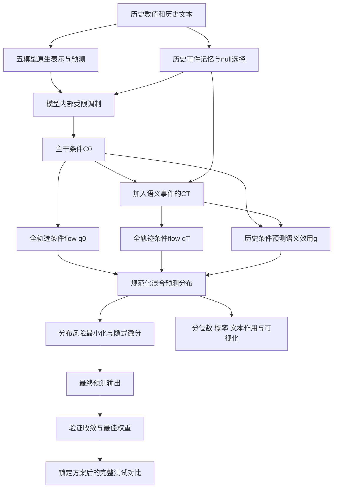

# V4：条件预测分布 → 显式分布建模 → 预测输出

## 1. 用户思想与实现边界

给定预测起点之前的历史数值X、历史文本T及原生模型表示，学习完整未来轨迹的条件密度 `p(Y[t:t+H] | X[<t], T[<t])`，再从分布作决策，而不是把分布作为与输出无关的辅助任务。

原五模型仓库与上轮插件代码保持不变；新代码独立放在 `plugins/distribution_semflow_v4/`。修改前私密Git标签：`pre_distribution_v4_20261005`。五模型分别使用该完整插件：历史事件记忆、模型内部条件调制、全轨迹条件flow、语义效用混合、分布决策头。各模型每个任务独立训练，不共享学习后的插件权重，不仅只给TaTS添加。

## 2. 与GANF的思想关系

借用GANF中“图结构提供条件依赖，可逆变换给出规范化密度与精确Jacobian”的思想，将其转换成未来残差轨迹的条件建模。四个交替affine coupling层覆盖全部H维残差；每层图权重由历史条件上下文生成，只有该层不变source坐标进入destination变换，因此密度Jacobian可计算。

它不是GANF原始异常检测任务，也不声称学习了可识别的真实因果DAG。这里的图是条件依赖结构，分布输出是预测用途；缺失文本、历史创新量和模型原生表示共同决定条件。

## 3. 条件分布的数学形式

令原生预测为b，训练集标准化尺度下局部历史scale为s（范围0.1至2，用于稳定残差尺度；不是重新定义评价归一化）。共享flow分别接受主干条件C0、语义增强条件CT，生成两个规范化完整轨迹密度q0、qT：

```text
R0 = Flow(Z | C0), RT = Flow(Z | CT), Z ~ N(0,I_H)
Y = b + s * R
p(Y | history) = (1-g) q0((Y-b)/s | C0) / s^H
               + g qT((Y-b)/s | CT) / s^H
```

g为整个未来轨迹的一个混合概率，由历史条件及覆盖率决定；同一个g用于联合密度和每个步长的边缘分布。不能一边用逐步不同的g作边缘采样，一边用平均g作联合密度。本实现确保二者一致。

C0包含数值历史、原生hidden及原生预测轨迹的水平、斜率和未来步坐标；CT增加历史语义事件证据。因为原生模型本就可能使用文本，C0不是严格无文本对照。qT相对q0表示新增事件条件的增量作用，不代表全部文本贡献。

每专家16个固定Sobol正负配对样本，共32个加权样本。混合是概率加权的两个分布，不是把两个专家样本逐点加权平均后冒充混合分布。采样只是有限样本近似；联合NLL使用可逆flow的密度公式和尺度Jacobian，不用采样近似密度。

## 4. 输出直接由分布计算

移除上版独立decision线性头。最终预测是混合分布的经验Bayes决策：

```text
a* = argmin_a E_p[(a-Y)^2 + 0.5 sqrt((a-Y)^2 + 0.02^2)]
```

该风险用于计算输出，对绝对误差作0.02的平滑以便微分，所有运算均在训练段标准化的目标尺度。训练点损失与评价MAE仍使用实际绝对值，不对评价指标作平滑。

决策方程为 `2(a-E[Y])+0.5 E[(a-Y)/sqrt((a-Y)^2+eps^2)]=0`，导数始终≥2，解唯一。24次二分求解（解在分布均值±0.25之内），再用隐式微分将点损失传回样本、flow、条件和混合概率。因此修改flow形状/位置会改变预测输出，不再存在“训练了分布但点预测不使用flow”的缺口。

纯MSE最优决策是分布均值，纯MAE最优决策是中位数；本轮输出使用组合风险，不宣称一个预测可同时独立达到两者各自最优。

## 5. 语义有效性和原生结构

- 历史事件注意力增加null事件，可选择不读取任何文本；缺失文本的语义证据严格为零。
- 混合g由真实历史条件预测；训练时使用主干/语义专家条件NLL的差异作为效用teacher。只有语义专家有超出0.02/step的密度优势时teacher才为正。未来target仅进入训练损失，推理不读取未来数值或文本。
- 原生语义通路保留。实数特征增量受相对尺度限制；CFA仍保留其原有adapter，用小增量融合，避免替换原生能力。尚未加入专门的CFA冗余消融，不声称已经消除所有重复语义影响。
- SpecTF采用频率索引条件和复数幅度/相位乘性调制：最大幅度变化10%、相位变化0.05弧度，再乘可学习strength与证据可信度；DC和终端频点不额外旋转相位。零初始化保持起点恒等，并使修改适应频域表示。
- TaTS/CFA在encoder接入，MM-TSFlib在encoder与decoder接入，Aurora在decoder接入；全部使用条件分布与分布决策。
- 内部feature正则与输出偏移正则限制漂移，但不能保证所有测试任务改善。门控控制语义专家信任度，不关闭完整分布插件以伪造改善。

## 6. 优化与梯度路径

完整插件从上轮对应任务已经收敛的无插件原生checkpoint开始。对照也从同一checkpoint开始追加训练。二者都训练本来允许训练的主干参数，Aurora仍仅末两层及预测头；不改其他模型的原始结构。

主干学习率2e-5、插件3e-4；AdamW wd1e-4；batch32；梯度裁剪1；ReduceLROnPlateau patience5/factor0.5/minlr1e-6。点损失MSE+0.5MAE；NLL最大0.01、20轮渐增；CRPS0.005；输出偏移正则0.02；效用teacher BCE0.002；特征调制正则0.005。

NLL在context与g处detach，直接训练flow密度参数，不直接推动主干条件表示或语义门控；点风险通过实际分布样本和隐式决策传回flow与主干。低权重CRPS仍可通过采样影响共享条件，用于校准。门控utility只更新reliability网络，因为其输入q/events已detach。不是完全冻结插件或把所有分布梯度都切断。

相比上版同时修改损失路由、语义信任、频域调制、起始权重与决策方式，这是一次整体迭代，不是单因素因果实验。测试增益不能归因于其中某一个修改。

## 7. 完整实验与收敛

180任务：五模型×九领域×四长度；每任务有新插件和匹配追加训练control，共360训练、360评估，seed2026。任务按领域/长度交错模型，不先把一个模型36项全部跑完才开始另一个模型。

|领域|预测长度|
|---|---|
|Agriculture/Climate/Economy/Security/SocialGood/Traffic|6/8/10/12|
|Energy/Health|12/24/36/48|
|Environment|48/96/192/336|

使用相同Readgpt canonical数据、历史24、70/10/20时间划分、训练段统计标准化；校验数据SHA256和配对测试target/origins。只有历史文本作为输入，BERT和Aurora均加载本地权重，禁用HF联网。

验证分数为 `0.5*MSE/MSE_init+0.5*MAE/MAE_init`；至少45轮，连续25轮最佳分数改善不超过1e-5后停止，恢复验证最优权重再测试。无插件对照初始checkpoint纳入验证候选；插件第0轮仅作原生参考，不作为已拟合插件候选。插件完成20轮分布升温后才允许选择权重，确保最终包含实际学习的条件分布。每10轮保存可恢复训练状态，2000轮仅安全上限，未满足平台期不写COMPLETED、不评估最终测试。这里的收敛是验证平台期，不证明全局最优或测试集最优。

参数在测试前冻结，不做测试驱动筛选。全部插件任务如实保留，改善/变差都输出，不按测试分数回退原版。

## 8. 显式分布显示与交付

每任务保存：完整预测、目标、预测起点、条件均值、5%/50%/95%分位数、语义混合概率、语义分布决策增量、相对最后观测的上涨概率。`distribution_profile.csv`为每个预测起点的摘要；`conditional_distribution.png`显示预先固定的第一个测试起点的轨迹区间、分布均值、分布决策与样本直方图；该图为原始目标单位，MSE/MAE仍在训练段标准化尺度计算。

语义增量是改变额外语义条件分支的模型内比较，不是因果解释，也不是整个模型文本作用的完整贡献。区间与直方图均来自有限加权样本，不能当作保证覆盖率的置信区间。

全量输出MSE/MAE、联合NLL/step、CRPS近似、90%覆盖率近似；正式结果目录为outputs_full_fitted；最初启动outputs_full保留，因可能选到未学习分布的epoch0而中止，不混入最终实验。每完成配对更新完整对比表与图。比较本轮追加control、上一轮原生control、上一轮内部插件，以及历史原版（后者协议不同，单列参考）。

所有远端写入在 `/xiliang/LXY/`，唯一环境 `/xiliang/LXY/envs/lxy`，GPU1/2每卡一个任务，不触碰他人进程。完成后下载到本地baseline文件夹，并把代码与分析提交私密Git。


