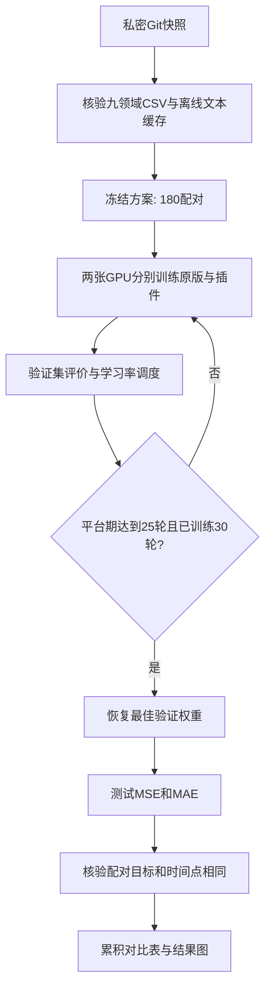

# 全量收敛实验：五模型 × 九领域 × 四步长

## 目标与代码保存

本轮冻结上一轮内部语义事件融合与条件轨迹分布插件，不根据测试结果继续调参。修改前快照为私密仓库 `Lxyyy10083/TimeMMD-five-model-baselines` 的标签 `pre_full_converged_lab_20261004`。新的驱动与训练代码位于 `plugins/internal_semflow_full_lab`，五个原始模型仓库与已经完成的精简实验代码不修改。

## 实验矩阵

- 模型：SpecTF、CFA、TaTS、MM-TSFlib、Aurora。
- Agriculture、Climate、Economy、Security、SocialGood、Traffic：6、8、10、12。
- Energy、Health：12、24、36、48。
- Environment：48、96、192、336。
- 180项任务分别训练无新增插件的原版架构和内部融合插件版，共360次训练、360次测试评估。不是只训练一个模型再复用其插件权重。

## 统一设置

使用TaTS-main-change-Readgpt来源的已对齐CSV，核验manifest中的SHA256。历史长度24；按时间顺序70%/10%/20%划分；预测目标不跨越所属划分边界；只用训练段均值和标准差标准化。历史文本使用本地冻结BERT，缺失文本明确遮罩，不读取未来文本。所有对照与插件预测的测试时间点及target数组逐项核验相同。

seed=2026，batch=32；AdamW，主干学习率1e-4、插件3e-4，weight_decay=1e-4，梯度裁剪1；ReduceLROnPlateau每5轮平台期学习率减半，最低1e-6。点损失为MSE+0.5MAE；插件NLL权重0.03，10轮渐增；CRPS近似项0.02、修正约束0.001。

模型原生结构、维度和原有多模态分支保留。Aurora仍使用已有本地预训练权重，训练末两层encoder/decoder及预测头；不是把各模型结构强行设置一样。同模型原版与插件版使用相同可训练主干设置。新的跨模型接口和文本编码与历史原始论文运行协议存在差别，因此本轮公平对照与历史原版结果分别列出，不把跨协议差异归因于插件。

## 收敛与权重选择

每轮在验证集计算 `S=0.5*MSE/MSE_initial + 0.5*MAE/MAE_initial`。每项原版与插件使用其初始验证指标作尺度，避免Security数值量级影响统一早停阈值。至少训练30轮；最佳S的改善超过1e-5才重置等待计数。连续25轮没有这样的改善，判为验证平台期并早停，恢复最佳S对应权重，再测试。该规则表示可操作的验证收敛，不证明全局最优，也不保证两个测试指标都下降。

2000轮是安全上限；触及上限而未满足平台期的任务记为NEEDS_MORE_TRAINING，不写COMPLETED、不评估最终测试。此时需要记录延长训练协议再继续。每10轮原子保存可训练参数、优化器、调度器、随机数状态与历史记录，意外中断可用相同指令断点续训。最佳权重按验证结果保存，测试不参与调参或模型选择。

## 运行与输出

全部远端写入在 `/xiliang/LXY/`，解释器 `/xiliang/LXY/envs/lxy/bin/python`。使用GPU1、2每卡一个任务，先顺序完成九领域离线BERT缓存，防止并发写同一个缓存。禁止HF联网；不干预他人进程。

```bash
cd /xiliang/LXY/baseline_v3_lab_20261004
/xiliang/LXY/envs/lxy/bin/python -u plugins/internal_semflow_full_lab/run_full.py
```

每完成一个原版/插件配对，更新 `outputs_full/RESULTS.json`、`comparison.csv`、`收敛实验结果.md` 及MSE/MAE对比图。下降百分比为 `(原版误差-插件误差)/原版误差*100`，负值如实表示变差。历史原版单列于JSON中，不能与本轮公平对照混用。每项另存训练曲线、最佳轮次、总轮次、收敛标记、测试预测与真实值；异常保留日志并继续其他任务。只有180配对全部完成且无异常才生成FULL_COMPLETED。



本轮单种子完整复现，不能给出统计显著性结论。待完整结果产生后再比较五模型和九领域的改进覆盖率，禁止只汇报改善项。
