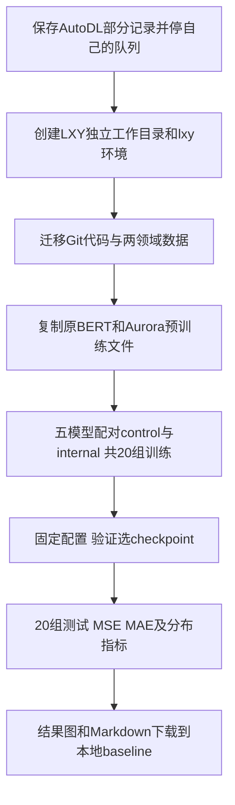

# 实验室服务器迁移与精简迭代

## 用户约束

服务器使用VSCode已有Remote SSH配置。仅在 `/xiliang/LXY/` 中创建和修改文件；不删除其他目录内容，不杀他人进程。只创建并使用 `/xiliang/LXY/envs/lxy` 一个实验虚拟环境。缓存、临时文件和日志同样位于LXY。SSH密码不写入文件或Git。

AutoDL的V3队列已经通过核对命令行和独立进程组，停止了本实验自己的PID74425及其子进程。保存了157组训练日志与JSON记录，原模型与checkpoint留在AutoDL；本地保存 `v3_partial_for_migration.zip`。后续不依赖AutoDL继续开机。

## 缩减范围

取消五模型九领域四长度两组参数的540组训练队列。改为五模型两个任务：Agriculture/12、Economy/10；前者是短预测任务，后者覆盖此前SpecTF明显退化的情况。两领域不代表全部TimeMMD领域，下一步是否扩大范围应取决于这轮诊断结果。

每个模型仅一组balanced插件配置与一个匹配control，共20组训练、20组测试。使用已固定参数，按验证集选择checkpoint，不跑网格。最大60 epoch、最少10、patience10、batch32、seed2026、主干lr0.0001、插件lr0.0003、NLL0.03、CRPS近似权重0.02、MAE权重0.5、NLL升温10 epoch；保留验证集降学习率。达到上限的组明确标注，不能声称全部收敛。

本轮control与插件均从相同种子初始化训练；Aurora使用实验室已有的预训练模型副本。AutoDL已无法连接，因此不假装已迁移原control checkpoint。比较以本轮配对control为主，不把训练预算变化当成插件收益。

## 数据和代码

新工作目录 `/xiliang/LXY/baseline_v3_lab_20261004`，原实验室项目不覆盖。

复制本地Git版本的五模型代码、独立插件和Readgpt统一数据。BERT与Aurora预训练模型从 `/xiliang/LXY/` 内原目录复制到新workspace/models，原模型文件保留。仍使用70/10/20时间切分、历史长度24、训练集统计量归一化，文本只来自历史窗口。

V3内部事件记忆、语义调制、位置与居中全轨迹flow保持一致，训练代码独立为 `plugins/internal_semflow_lab`，不会覆盖V2/V3。

## 性能开销修正

Aurora的多数预训练参数冻结，原先每次最佳epoch保存整个模型，会反复写入约800MB以上数据。实验室版checkpoint只保存可训练参数和buffer；冻结参数每次从workspace内不变的预训练副本恢复。恢复时校验所有可训练参数和buffer齐全，避免静默丢失已学权重。

## 环境与GPU

GPU0已有别人的进程，不操作。启动时GPU1和GPU2空闲，队列指定 `CUDA_VISIBLE_DEVICES=1`，单卡串行。

唯一实验环境 `/xiliang/LXY/envs/lxy`：Python3.10、PyTorch2.5.1 CUDA12.1、torchvision0.20.1、transformers4.40.2等。CUDA12.1适配现场535.183.06驱动。环境构建器位于LXY，创建Python运行时也在LXY。不会修改系统环境。

## 流程与记录

实际状态由 `outputs_pilot/PROGRESS.json`、FAILED.json、FULL_COMPLETED.json核对。后台任务使用lxy/bin/python，非系统Python；系统Python只用于启动器管理文件和创建环境，不运行实验。修改前Git快照已保存，新迁移代码提交私密GitHub后部署。
