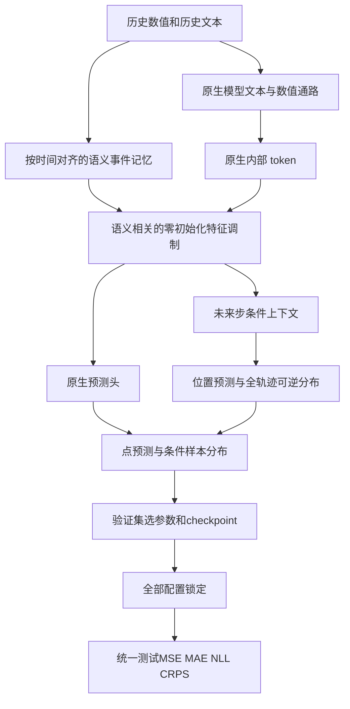

# V3：保留原生语义通路的条件分布融合

## 退化证据与原因假设

上一轮相对匹配 control，SpecTF 平均 MSE 上升 5.16%、MAE 上升 1.48%；CFA 分别上升 1.21%、1.57%。这些是九领域四长度的相对变化宏平均。

SpecTF 最大退化包括 Economy/10（MSE +82.6%）、Health/36（+38.5%）、Health/24（+37.7%）。CFA 包括 Health/48（+31.8%）、Security/10（+17.1%）。SpecTF control 的 36 组中 14 组到达200 epoch上限，internal 无上限组、9组最佳epoch不超过5：更复杂插件可能更早过拟合，也存在 control 训练不足。这些现象不能单独证明因果。

代码中已确认的差异：

1. 原 InternalFusion 的增量由 numeric query 和 evidence 拼接生成，即使 evidence 弱也能产生数值分支增量；仅判断文本存在并不判断文本有用。
2. CFA 的融合版本关闭原生 pooled text adapter，变成替代实验，无法判断是新模块不足还是丢失原生能力。
3. SpecTF 同时把原文本频带读取方式改为全部频带加权，模块效果和频带方案变化混杂。
4. flow 的样本均值/中位数既用于点预测，NLL又直接更新 base，位置和形状目标相互耦合。有限样本中位数也可能影响稳定性。
5. 所有插件使用统一固定学习率；不同窗口尺度、序列长度与小样本域适配不足。

## 思想与实现

学习分布 `Y = native(X,T) + s(X) * [location(X,T,H) + centered_flow(Z | X,T,H)]`。

- 保留所有五模型原生文本与数值通路，CFA adapter继续训练，SpecTF采用原频带读取方式。
- 历史语义事件记忆仍按时刻对齐，用数值创新与文本相关性建立事件权重；模型内部 token 查询事件记忆。
- 特征增量乘以语义 evidence，并按 token RMS 调整尺度。零初始化投影使初始预测继承 control，后续梯度进入原生主干。
- 点预测由零初始化位置头学习；flow 负责完整预测轨迹的残差形状。用确定性采样均值居中，使采样分布的经验均值与位置预测一致。
- 密度目标中的点预测 detach，避免直接产生第二套位置监督；条件隐藏特征仍接受密度梯度，所以不是只在输出后挂一个校正器。
- flow 的可逆变换仍在全预测长度上计算，记录居中变换后的 NLL、CRPS 与90%区间覆盖率。采样与居中都是有限样本近似；未声称发现真实因果图。

## 实验设置

五模型 × 九领域 × 四预测长度，seed2026，使用相同 Readgpt 数据、70/10/20 时间切分、历史长度24、训练集统计量归一化、无未来文本输入。

|配置|插件学习率|NLL权重|CRPS近似权重|MAE权重|
|---|---:|---:|---:|---:|
|continued control|0.0003（无可训练插件）|0|0|0.5|
|balanced|0.0003|0.03|0.02|0.5|
|strong|0.001|0.10|0.05|0.5|

所有配置：继承对应 V2 control 的原生主干和原生文本编码器权重；主干学习率0.00002，AdamW、weight decay0.0001，batch16，最大300 epoch、最少30、patience25、梯度裁剪1。ReduceLROnPlateau：patience5、factor0.5、最小学习率0.000001；NLL升温20 epoch。初始化 checkpoint 纳入验证选择，避免丢弃已训练的基线。模型新增参数独立训练，五模型不共享权重。

共540组训练：180组追加训练control、360组插件参数实验。每个任务仅在验证集选择 balanced/strong，按相对 continued control 的 MSE/MAE 平均比值选择。所有180项选择固定后，才评估360组测试（选中插件+control）。不根据测试分数挑参数，不隐藏退化，不用 control fallback 冒充插件提升。

continued control 用于区分模块效果与额外训练预算；旧 control 也保留。仍然是单种子探索实验，且本轮设计看过旧测试表现，需要新时间段或独立数据验证最终泛化结论。不能保证所有任务都提升，达到上限的运行不称为已收敛。

## 文件与运行

原五个论文仓库和 V2 插件均不修改。V3位于 `plugins/internal_semflow_v3/`：core.py（事件、融合、分布）、native.py（各模型接入）、train.py（统一训练评估）、iterate.py（完整参数队列）、report.py（汇总图）。

运行：`/root/miniconda3/bin/python -u plugins/internal_semflow_v3/iterate.py`。

Aurora V2 仍在运行，队列等待其评估完成再开始，避免竞争 GPU。所有运行配置、源文件哈希、日志、最佳epoch、上限状态与预测数组保留在 `outputs_20261004/`。错误保存 FAILED.json 后停止，避免批量重复失败。

## Git记录

修改前版本已推送至私密仓库，标签 `pre_internal_v3_20261004`。V3单独提交；服务器部署使用该提交的git archive。旧实验和失败记录保留。不会自动把服务器密码或模型权重提交到仓库。
