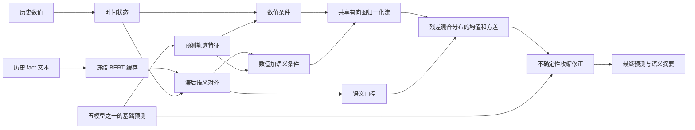

# 语义条件图流：五模型共用的未来分布插件

## 目标与来源

这次插件借鉴 GANF 的图条件归一化流思想，但预测任务与 GANF 原文的异常检测任务不同。用户提供的 `GANF/TaTS-main-change-Readgpt/layers/PredictiveGraphFlow.py` 已将未来残差转为 DCT 系数并学习流分布。本实现进一步把**文本的条件价值**直接并入密度估计、混合分布和点预测，使文本不只作为串接特征。原始论文代码和前一轮 baseline 已分别保留在 Git 历史 `9868e4f` 和 `81a511c`；本插件位于 `plugins/semflow/`，不修改五个原模型权重或源代码。

五模型：TaTS、MM-TSFlib、SpecTF、CFA、Aurora。每个模型输出相同预测原点的 `base_pred[B,H,1]`。同一插件读取该原点之前的数值 `history[B,L,1]`、文本向量 `text[B,L,768]` 和文本有效位；输出修正预测及可读的分布摘要。

## 核心思路

令基础预测为 $\hat y_0$，未来真实值为 $y$，预测残差为 $r=(y-\hat y_0)/s$，其中 $s$ 是历史窗口的数值尺度。先用前 $K$ 个离散余弦系数表示未来整段残差，使插件学习的是**下一段轨迹的条件分布**，不是单步噪声。

1. GRU 读取预测原点之前的数值窗口，得到时间状态。
2. 冻结的 BERT 将每行 `fact` 编成语义向量；动态的短延迟对齐把历史文本对应到数值状态，并屏蔽空文本。任何预测原点之后的文本均不进入输入。
3. 分别形成仅数值条件 $c_{ts}$ 和数值加语义条件 $c_{joint}$。两者共享同一个可逆图流 $p_\theta(r\mid c)$。图边只指向 DCT 顺序中的前驱系数，形成可精确计算似然的有向无环结构。图边表示预测残差系数之间的统计依赖，不宣称真实变量因果关系。
4. 用两种条件的似然优势为语义门控提供训练信号。门控在推理时仅由历史数值和历史文本决定，形成 $p(r)=(1-g)p(r\mid c_{ts})+g p(r\mid c_{joint})$。无文本时 $g=0$。
5. 固定的反向配对 Sobol 样本给出分布均值与方差。点预测由分布均值产生修正，并随方差增大而收缩。训练同时优化点预测误差、流负对数似然、语义门控和轻量修正正则项。这里的“语义显示”是观测性的模型解释，包括文本权重、预测方向、预期变化、模型不确定性和两种条件的均值差，不等同于因果解释。



## 数据与公平性

- `plugins/semflow/data.py` 读取上一轮已验证与 ReadGPT 对齐的 `fit.npz`、`holdout.npz`、`test.npz`，五模型共享同一领域、步长、数值标准化、预测原点和目标。底模冻结；这是统一的后训练插件比较，不是五模型重新端到端训练。
- 每个领域仅计算一次冻结 BERT 文本缓存。所有模型使用同一缓存及相同代码、学习率、轮数、早停规则、DCT 系数数目和 Monte Carlo 样本数。仅步长按领域原协议变化。
- 训练仅用原验证区间前 70% 的预测窗口；后 30% 用于选 epoch 和每模型修正系数 `alpha`。测试集只在选择完成后计算一次。只有 holdout 上 MSE 和 MAE 同时比原模型下降至少 0.2% 才启用修正。这个安全门可以避免多数无收益修正，但不保证独立测试集必然改善。
- MSE、MAE 在与原 baseline 相同的训练段标准化空间计算。不会把标准化值与反归一化值混比。
- Aurora 的既有预测为已监督适配后的结果，不能把本比较解释成纯零样本模型比较。

## 文件与运行

| 位置 | 作用 |
|---|---|
| `plugins/semflow/model.py` | 语义条件图流、概率密度、预测、语义摘要 |
| `plugins/semflow/data.py` | BERT 文本缓存、五模型共享原点数据接口 |
| `plugins/semflow/run.py` | 36 个领域/步长插件训练和 180 项独立测试评估 |
| `plugins/semflow/runs/` | 每组 checkpoint、训练日志、五模型测试预测及结果 |

服务器上从实验副本根目录执行：

```bash
/root/miniconda3/bin/python -u plugins/semflow/run.py > plugins/semflow/semflow.log 2>&1
```

结果状态以 `plugins/semflow/runs/all_results.csv` 和各领域 `result.json` 为准。训练异常应由日志逐条修正，不把尚未结束的模型称作已收敛。最终指标应同时报告启用率、MSE/MAE 变化及退化案例；不能保证 180 个独立测试点全部改善。

## 与给定 GANF 改版的差异和局限

给定改版把分布模块嵌在 TaTS 骨干内；这里通过五模型统一的预测接口与残差表示获得可移植性，并显式训练“历史文本究竟是否改善条件密度”的门控。BERT 文本缓存共享；图流作用于未来轨迹残差系数，不直接强加给原骨干。限制包括：后训练插件无法恢复底模已经丢失的信息；文本与结果间可能有时间戳或内容来源偏差；标准化 MSE 很大的 Security 区域会拉大总体均值，应逐领域看；有限的验证区间和超参数选取会造成泛化不确定性。任何“语义影响”只表示模型条件预测变化。
