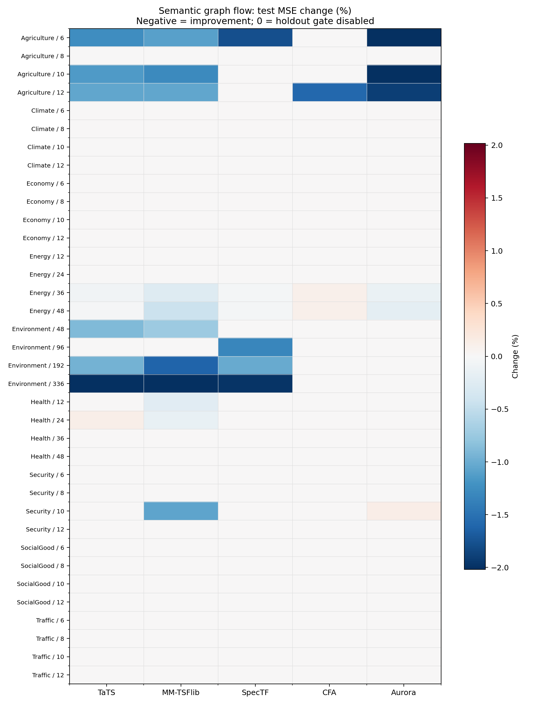
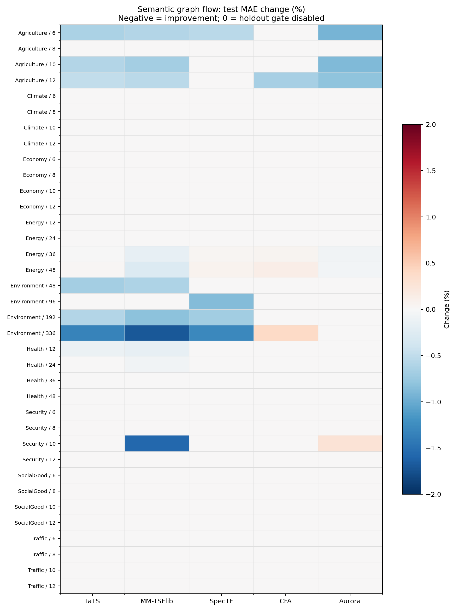

# 语义条件图流：完整测试结果

- 共 180 组：9 领域 × 4 步长 × 5 模型。
- 验证集启用修正：37/180；测试集 MSE 与 MAE 同时改善：28/180。
- 测试集至少一个指标变差：9/180；其余为保持原预测或两指标改善。
- 负的变化百分比表示误差下降。所有指标都在训练集拟合的标准化空间计算。
- 门控和修正系数只在验证集选取，测试集未参与选择。因此不能保证全部 180 项在测试集下降。

## 各模型汇总

| 模型 | 启用 / 36 | 两指标改善 / 36 | 至少一项变差 / 36 | 平均 MSE 变化 | 平均 MAE 变化 |
|---|---:|---:|---:|---:|---:|
| TaTS | 10 | 7 | 3 | -0.22% | -0.12% |
| MM-TSFlib | 11 | 11 | 0 | -0.32% | -0.20% |
| SpecTF | 6 | 4 | 2 | -0.17% | -0.09% |
| CFA | 4 | 1 | 3 | -0.04% | -0.00% |
| Aurora | 6 | 5 | 1 | -0.18% | -0.07% |

## 图与逐项数据

逐项完整数值见 `complete_metrics.csv`。单模型校准的训练轮数和验证轨迹见服务器 `refined/{domain}/{horizon}/{model}/result.json`；共享版见 `runs/{domain}/{horizon}/result.json`。两组记录也已打包于本地结果文件夹。

## 与共享版比较及问题定位

共享版也有 37 项启用、28 项双指标改善、9 项至少一个指标退化。单模型校准的最优轮数在 167/180 项为 0，说明当前验证数据没有支持额外的底模专用参数更新。两版的整体覆盖率相同；不能把细小的均值差解释为稳健收益。

从领域看，Agriculture 启用 11 项，Energy 10 项，Environment 10 项，Health 4 项，Security 2 项；Climate、Economy、SocialGood、Traffic 均为 0。高覆盖领域有明显历史残差模式，且文本或图流可以提供少量增益；低覆盖领域可能是底模残差已经很小、文本时间对齐不稳定，或本插件的保守修正幅度和验证门槛过强。这里是基于结果的推断，尚无消融实验能分离这几种原因。

9 个测试退化项分别出现在 CFA/Energy 36、SpecTF/Energy 36、CFA/Energy 48、SpecTF/Energy 48、TaTS/Energy 48、CFA/Environment 336、TaTS/Health 12、TaTS/Health 24、Aurora/Security 10。验证集门控不能保证分布转移后的测试集仍有益。下一步若要追求更广泛的提升，需要优先做文本缺失、文本打乱和时间戳偏移消融，再检查未启用任务是否有可识别的条件密度差；不能通过反复看测试指标来选新门槛。
