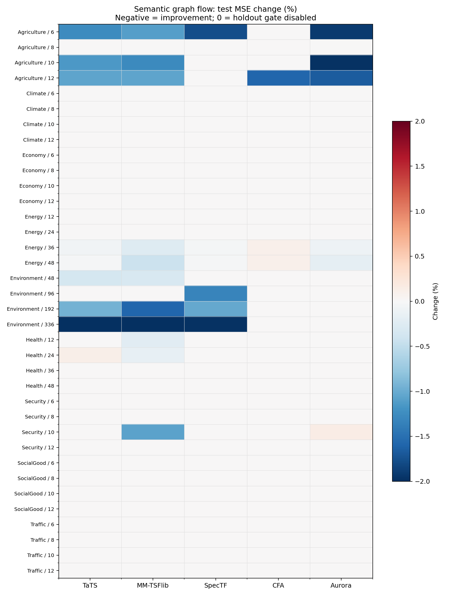
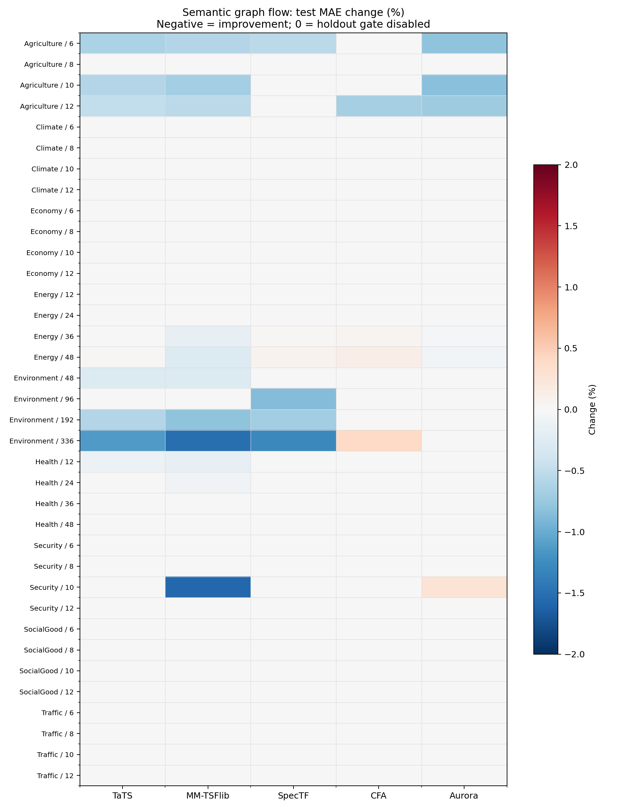

# 语义条件图流：完整测试结果

- 共 180 组：9 领域 × 4 步长 × 5 模型。
- 验证集启用修正：37/180；测试集 MSE 与 MAE 同时改善：28/180。
- 测试集至少一个指标变差：9/180；其余为保持原预测或两指标改善。
- 负的变化百分比表示误差下降。所有指标都在训练集拟合的标准化空间计算。
- 门控和修正系数只在验证集选取，测试集未参与选择。因此不能保证全部 180 项在测试集下降。

## 各模型汇总

| 模型 | 启用 / 36 | 两指标改善 / 36 | 至少一项变差 / 36 | 平均 MSE 变化 | 平均 MAE 变化 |
|---|---:|---:|---:|---:|---:|
| TaTS | 10 | 7 | 3 | -0.20% | -0.11% |
| MM-TSFlib | 11 | 11 | 0 | -0.30% | -0.18% |
| SpecTF | 6 | 4 | 2 | -0.17% | -0.09% |
| CFA | 4 | 1 | 3 | -0.04% | -0.00% |
| Aurora | 6 | 5 | 1 | -0.16% | -0.06% |

## 图与逐项数据

逐项完整数值见 `complete_metrics.csv`。每个实验的训练轮数和验证轨迹见服务器 `runs/{domain}/{horizon}/result.json`。
