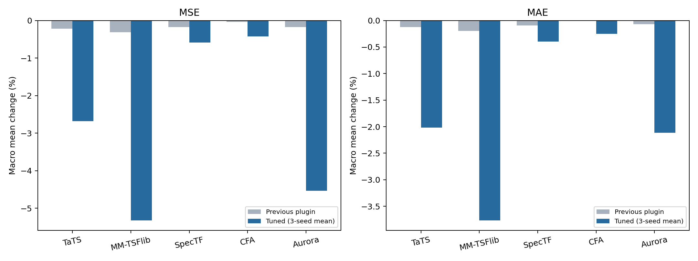
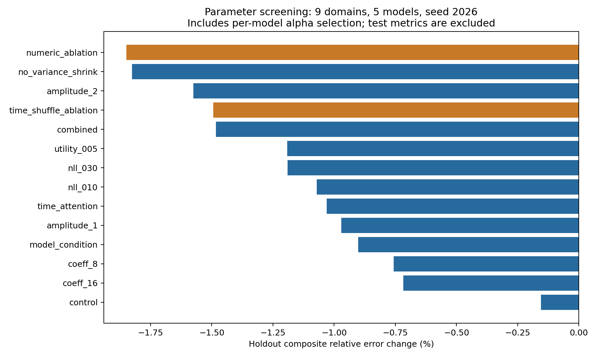

# 参数实验结果与分析

锁定配置：`no_variance_shrink`。筛选依据为九领域五模型、两种随机种子的隔离 holdout；最终覆盖 36 个领域/步长、三个种子，共 540 条测试记录，汇总为 180 个模型任务。

三种子平均结果中，62/180 项 MSE 与 MAE 同时下降，14/180 项至少一个指标上升，104/180 项维持原预测。这里的“平均”是独立训练性能平均，不是对三个预测做集成。

## 与原底模比较

|模型|启用任务 / 36|双指标改善|至少一项退化|平均 MSE 变化|平均 MAE 变化|
|---|---:|---:|---:|---:|---:|
|TaTS|19|16|3|-2.68%|-2.02%|
|MM-TSFlib|20|19|1|-5.32%|-3.76%|
|SpecTF|11|10|1|-0.59%|-0.40%|
|CFA|10|6|4|-0.42%|-0.25%|
|Aurora|16|11|5|-4.53%|-2.11%|

负值表示误差下降。宏平均按每项相对变化计算，避免 Security 的绝对误差主导汇总；全部 MSE/MAE 与原底模在相同训练段标准化空间计算。初始化 epoch=0 的图流是恒等映射，配对采样存在约 1e-9 历史标准差单位的浮点误差，会让严格小于 1 的选择规则产生无意义的非零 alpha。启用数排除了这些恒等 checkpoint；结果本身完整保留，变化小于 0.00001% 的项目按持平统计。

## 参数筛选与收益归因

本轮同时检查了修正幅度、方差收缩、DCT 维度、NLL 权重、语义效用权重、语义注意力和模型条件化。较大损失权重是否有效以验证排行为准；组合配置有多个参数同时改变，不能归因于单一因素。

|配置|修正上限|初始 logit|方差系数|K 上限|NLL 权重|语义权重|首轮验证综合变化|
|---|---:|---:|---:|---:|---:|---:|---:|
|numeric_ablation|2.0|0.0|0.25|8|0.1|0.05|-1.85%|
|no_variance_shrink|1.0|0.0|0.0|4|0.03|0.01|-1.83%|
|amplitude_2|2.0|0.0|1.0|4|0.03|0.01|-1.57%|
|time_shuffle_ablation|2.0|0.0|0.25|8|0.1|0.05|-1.49%|
|combined|2.0|0.0|0.25|8|0.1|0.05|-1.48%|
|utility_005|1.0|0.0|0.5|4|0.1|0.05|-1.19%|
|nll_030|1.0|0.0|0.5|4|0.3|0.01|-1.19%|
|nll_010|1.0|0.0|0.5|4|0.1|0.01|-1.07%|
|time_attention|1.0|0.0|0.5|4|0.1|0.01|-1.03%|
|amplitude_1|1.0|0.0|1.0|4|0.03|0.01|-0.97%|
|model_condition|1.0|0.0|0.5|4|0.1|0.01|-0.90%|
|coeff_8|1.0|0.0|0.5|8|0.03|0.01|-0.76%|
|coeff_16|1.0|0.0|0.5|16|0.03|0.01|-0.72%|
|control|0.5|-2.0|1.0|4|0.03|0.01|-0.16%|

短步长下 K 被截断为 H，因此部分 K=8/16 试验实际维度相同。首轮排行包含无文本和时间打乱消融；晋级规则在运行前限定为三个真实文本配置，消融用于诊断，不作为多模态插件候选。

同协议 control 修复了 checkpoint 选择、目标窗口重叠，并统一采用 holdout 双指标严格改善即可启用。因此相对历史版的变化同时包含协议影响；参数效果应优先比较本轮同协议 control。

## 文本贡献检查

以下均为同一赢家参数、九领域五模型、两个种子的 holdout 对照；不参与测试集上的配置选择。

|输入|验证 MSE 变化|验证 MAE 变化|验证综合变化|
|---|---:|---:|---:|
|真实文本|-2.28%|-1.32%|-1.80%|
|无文本|-2.72%|-1.67%|-2.19%|
|窗口内打乱文本|-2.31%|-1.32%|-1.81%|

真实文本未优于无文本。当前收益可能主要来自历史数值残差校准，不能声称已证实深度语义融合带来额外收益。

## 训练与数据局限

正式训练记录共 108 组，19 组达到 80 轮上限，其中 19 组最佳 epoch 接近上限。其余使用验证集早停。达到上限的组不应被表述为已经完全收敛；训练和验证曲线见 `training_curves.png`。

Security/12 经 H-1 隔离后每底模只有 3 个 fit 预测原点；重叠窗口也不等于独立样本。三种子离散度反映优化随机性，不能代替独立时间块的泛化验证。测试集曾在历史实验中被查看，本轮属于探索性复现。

## 图与完整数据

完整 180 项均值、种子标准差、上一版指标和原始候选指标见 `results_180_mean_std.csv`；540 项独立种子指标见 `test_seed_results.csv`。权重和全部逐轮记录已归档在 `experiment_artifacts.tar.gz`。
