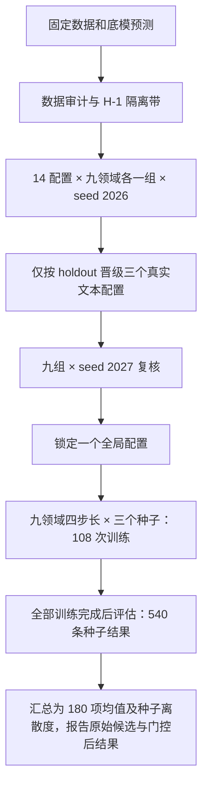

# 2026-10-03 参数实验：较强修正与较大分布权重

本轮代码位于 `plugins/semflow_tuning_v2/`，原插件作为历史对照保留。底模预测、训练集标准化、TimeMMD ReadGPT 数据与冻结 BERT 缓存复用。

共同协议调整：从插件 fit 尾部移除 `H-1` 个预测原点，保证 fit 与 holdout 的目标时间点不重叠；每个 epoch 都按五模型最终修正后的相对 MSE/MAE 选择 checkpoint。所有变体都允许较小的 holdout 双指标改善通过门控，alpha 在 0/0.25/0.5/0.75/1 中选择。门槛变动的影响通过同协议 control 对照区分，不把启用率增加直接解释为提升。

实验定义见 `experiment.py::variants()`。14 个配置包括历史参数 control、修正幅度 1/2、取消方差收缩、DCT 系数 8/16、NLL 权重 0.1/0.3、语义效用权重 0.05、文本时间注意力、底模身份条件，以及组合配置。组合配置使用修正上限 2、初始化 logit 0、方差系数 0.25、K=min(8,H)、注意力、模型条件化、NLL 0.1、语义效用 0.05、MAE 0.5，并按各底模 fit 基础误差平衡点损失。组合变化是综合试验，不能归因于单一参数。

另有与组合配置相同的两个消融：无文本、仅在当前历史窗口内部打乱文本顺序。后者保留历史文本集合，检查的是时间对应价值，不是完全去掉语义；它不引入预测原点之后的文本。



筛选最多 24 epoch，正式训练最多 80 epoch；最少训练 8 epoch，patience=8、AdamW lr=0.001、batch=256。正式训练最初预算 40 epoch；在只检查训练/holdout 记录时，发现已有 17 组达到预算且多组最优点接近最后一轮，因此在最终测试前延长预算。已完成并早停的组复用；接近 40 轮上限的组从同种子重新训练至新预算，旧权重与记录保存在 `budget40/`。本轮主体为 126 次初筛、27 次复核、108 次正式训练，另含预算延长重训和锁定赢家的文本消融。早停意味着使用最佳验证 checkpoint，不保证每个任务都充分收敛；报告每组实际训练轮数和训练曲线。低样本领域的窗口高度相关；例如 Security/12 隔离后仅余少量独立预测原点，应明确标注不确定性。

测试集不参与配置、epoch、alpha 的选择。由于该测试集已在历史实验中被查看，本轮是探索性复现，不能宣称新的完全未见测试。报告同时提供同协议 control 的验证结果、上一版测试结果与原底模测试结果，避免混淆参数和协议的变化。

运行：

```bash
/root/miniconda3/bin/python -u plugins/semflow_tuning_v2/experiment.py --stage all
```

可断点续跑：完成的 `fit_result.json` 自动跳过；所有正式训练完成后才允许最终评估。权重、完整训练记录和原始候选预测保存在服务器 `plugins/semflow_tuning_v2/outputs/`。
