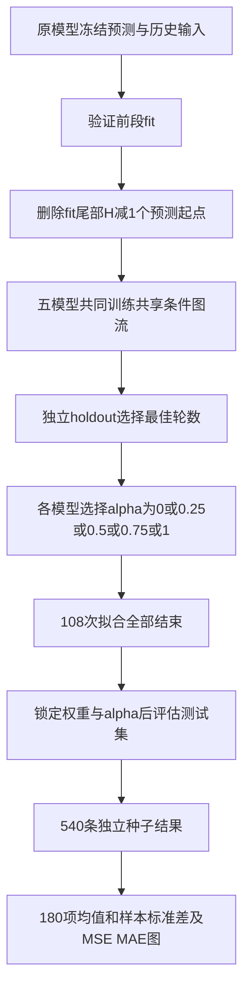

# V1截图版 no_variance_shrink 复现实验

## 恢复对象与版本保护

用户所说的V1以截图为准：2026-10-03锁定的`no_variance_shrink`，原归档目录名为`semflow_tuning_v2`。
从Git提交`b5e4d91`恢复`experiment.py`和`model.py`，逐字节SHA256记录于`SOURCE_SNAPSHOT.json`。
当前V4保存在私密仓库，恢复前标签为`pre_v1_no_variance_rerun_20261006`。
原目录和V4均保留，新实验使用独立目录。

## 原始输入

截图实验的输入为旧AutoDL `/root/autodl-tmp/carma_workspace/plugins/adapters/`。
五模型×九领域×四步长×fit/holdout/test，共540个NPZ文件。
这些文件包含原模型冻结预测、对应目标和数值历史；同时恢复原canonical CSV/manifest与BERT缓存。
下载及上传记录保存文件大小与SHA256。新实验不替换为V3/V4追加训练后的预测。

三种子是插件独立训练种子2026、2027、2028；原预测不随插件种子重训。
每个领域/步长/种子训练一个跨五模型共享的插件，共108次拟合，对五模型评估共540条记录，汇总180项。

## 原版参数

|参数|值|
|---|---|
|配置|no_variance_shrink|
|DCT系数数|4|
|hidden|32|
|分布样本数|16|
|修正上限|1.0|
|修正初始化logit|0.0|
|variance_beta|0.0|
|历史语义池化|uniform|
|model_conditioned|false|
|文本|real|
|NLL权重|0.03|
|语义utility权重|0.01|
|MAE权重|0.2|
|正则权重|0.005|
|balanced|false|
|训练预算|80轮|
|最低轮数／patience|8／8|
|batch／lr|256／0.001|
|优化器|AdamW，weight_decay=1e-4|
|梯度裁剪|1.0|

## 流程



alpha=0代表保持原预测；非零alpha只有holdout的MSE与MAE同时改善才启用，测试结果不参与选择。
并行调度只分配独立任务，不改训练函数、随机种子、数据、损失或选取规则。
仅使用实验室`/xiliang/LXY/envs/lxy/bin/python`，写入独立`/xiliang/LXY/baseline_v1_no_variance_20261006/`。
GPU1与GPU2开跑前检查是否空闲，不使用GPU0、不终止其他人的进程。

运行命令：

```bash
/xiliang/LXY/envs/lxy/bin/python -u /xiliang/LXY/baseline_v1_no_variance_20261006/plugins/v1_no_variance_rerun_20261006/run.py
```

## 边界与报告

截图原实验有部分拟合到达80轮上限。本次沿用80轮预算，达到上限仍在改善的任务会单独标记，不能描述为全部收敛。
改变预算会改变截图实验协议；如需进一步续训，必须独立记录。
本次不重新跑参数筛选或文本消融，不按测试成绩选新配置。
实验室的设备、Python和CUDA环境与旧AutoDL可能不同，因此不承诺逐位一致或一定获得相同改善百分比。
