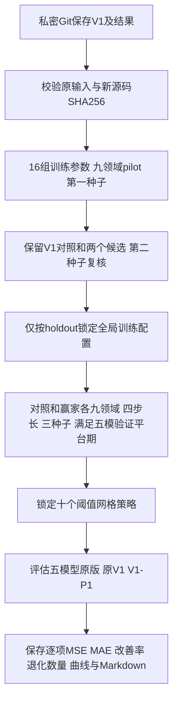

# V1参数实验：V1-P1

日期：2026-10-06。本文件先冻结方案，完成后另存包含结果的`V1参数实验结果.md`。

## 1. 保存与实现范围

当前代码、原V1和全部已有结果已推送到私密仓库，并创建修改前标签`pre_v1_hparam_20261006`，对应提交`52197ae`。新代码单独放在`plugins/v1_parameter_experiment_20261006/`，五个原模型仓库与原V1代码均不覆盖。

本轮仍是V1共享后置条件残差图流：原版预测冻结，一个领域/步长/种子训练一个共享插件，应用于五个模型。不是重新训练五个底模，也不是V2至V4内部融合实验。

新`experiment.py`以原V1训练函数为基础，正式阶段增加学习率衰减和五模型验证平台期检查；筛选阶段训练规则保留。新`model.py`仅将原本固定的语义效用teacher门槛0.05暴露为超参，默认值及公式保持原V1一致。所有修改和运行计划提交Git后才在服务器启动。

## 2. 固定条件

- 数据与原输入：截图V1所用TimeMMD ReadGPT数据、原版fit/holdout/test预测和BERT缓存，567个文件逐项SHA256校验。
- 历史长度24；数据时间切分和训练段标准化与原V1一致；没有改反归一化或MSE/MAE口径。
- fit尾部移除H−1个预测原点，隔离fit与holdout目标重叠。
- K=4、hidden=32、样本数16、variance_beta=0、uniform pooling、不启用模型身份条件。
- AdamW、weight decay=0.0001、batch=256、梯度裁剪1。
- 初筛/复核最多24轮，至少8轮、patience=8；正式训练至少32轮、patience=20，2000轮仅为安全上限，不是完成标准；初始化epoch0保留为候选。
- 实验室仅`/xiliang/LXY/`目录、仅`/xiliang/LXY/envs/lxy`环境；首次启动用空闲GPU2。v2停止后GPU2已被其他进程占用，v3启动前按nvidia-smi仅选择显存占用低于100MB的空闲卡，记录到启动文件，不结束其他进程。

### 按用户“确保收敛”的补充：正式收敛方案v3

此次修改前另创建并上传标签`pre_v1_p1_convergence_20261006`（提交`30d7f82`）。初筛、复核及选中的学习率0.003保留；暂停时已完成的80轮正式任务放在原`outputs/final/`，仅作过程存档。收敛方案v2第一组在168轮结束，第二组在2000轮时仍有验证改善，学习率已到1e-6下限；代码拒绝完成且未评估测试。v2全部训练记录保留在`outputs/convergence_v2/`，不混入最终结果。v3仅将调度下限改为1e-8、eps=1e-12，评分阈值和停止条件不变，重新运行两组正式配置，单独放在`outputs/convergence_v3/final/`。

正式阶段同时重新训练V1原参数对照和调参赢家，采用相同规则：

1. 原始插件验证评分为每个底模的`0.5*(raw_MSE/base_MSE + raw_MAE/base_MAE)`，不经过alpha回退，避免alpha=0掩盖尚未训练稳定的插件。
2. 五个底模各自的原始评分与原V1选用评分均连续20轮未改善超过绝对值1e-5，且已经训练至少32轮，才允许结束。所有评分只读holdout。
3. AdamW保持不变。ReduceLROnPlateau监测五模原始验证评分均值，5轮平台后学习率减半，绝对改善阈值1e-5，下限1e-8、eps=1e-12；对照和新参数使用相同调度。下限不是强制停止条件，持续改善仍然继续训练。
4. 每轮保存学习率、损失、五模原始/选用MSE与MAE比值、各平台计数。选择最佳权重仍沿用V1的选用验证评分，保留alpha=0候选；稳定终点与最佳预测权重是两个概念。
5. 如达到2000轮仍未满足规则，保存`NOT_CONVERGED.json`并停止，不保存为成功拟合，不进入最终测试。只有全部正式拟合满足规则才评估。

这里“收敛”指上述可核对的验证平台期，并非数学上保证神经网络达到全局最优。五模型底模预测保持冻结，本轮确认收敛的是共享V1插件在五种原模型输入上的训练。

原80轮V1历史权重额外保留。最终同时比较历史V1、相同停止规则的收敛V1、收敛调参配置，分别报告调参相对收敛对照的新增收益，避免将额外训练收益全归为超参改进。

## 3. 16组训练超参

除表中一项变化外，全部保持V1原参数：NLL=0.03、语义效用=0.01、MAE=0.2、偏移正则=0.005、修正上限=1、teacher门槛=0.05、学习率=0.001、不按模型平衡损失。

|配置|变化|目的|
|---|---|---|
|v1_control|无变化|相同24轮筛选预算的V1对照|
|nll_010|NLL权重0.1|加强条件密度约束|
|nll_030|NLL权重0.3|检查较强密度监督是否影响点误差|
|utility_005|语义效用权重0.05|加强语义可靠性监督|
|utility_010|语义效用权重0.1|检查更强门控监督|
|mae_050|MAE权重0.5|平衡MSE与MAE|
|mae_100|MAE权重1.0|加强绝对误差优化|
|regularity_000|偏移正则0|允许更自由的预测修正|
|regularity_002|偏移正则0.02|限制对原预测的漂移|
|amplitude_05|修正上限0.5|检查较小修正|
|amplitude_2|修正上限2|检查较强修正|
|teacher_margin_000|语义teacher门槛0|放宽语义效用teacher|
|teacher_margin_015|语义teacher门槛0.15|提高语义效用teacher要求|
|lr_0003|学习率0.0003|检查更平缓优化|
|lr_003|学习率0.003|检查更快优化|
|model_balanced|按各底模fit基础误差归一化点损失|减少不同底模误差量级对共享训练的支配|

这轮主要为单因素实验，减少同时改很多参数的归因困难。没有改变GANF图流结构，也没有把模型专用模块缝接起来。

## 4. 权重和阈值具体含义

训练目标为：

```text
L = MSE + lambda_MAE * MAE
    + lambda_NLL * mixture_NLL
    + lambda_utility * semantic_BCE
    + lambda_reg * mean((prediction - base)^2)
```

NLL在DCT残差系数条件密度上计算，语义效用teacher来自数值/语义两个条件密度的损失差；它不等价于已验证文本独立带来增益。

```text
teacher = sigmoid((NLL_numeric - NLL_semantic - utility_margin) / 0.25)
```

`utility_margin`是训练中的密度损失差门槛，与下面的验证MSE/MAE改善门槛是两种不同参数。teacher只在训练损失中读取target；推理门控只读取历史条件。

最终选择权重alpha：`chosen = base + alpha * (raw_plugin - base)`。原V1的alpha候选为0/0.25/0.5/0.75/1；alpha=0代表保留原预测。

验证启用要求为：`holdout_MSE_ratio < 1 - tau`且`holdout_MAE_ratio < 1 - tau`，在通过要求的候选中选择两项比值均值最小者。没有通过则alpha=0。

## 5. 验证启用门槛与alpha网格敏感性

预先锁定tau为0%、0.25%、0.5%、1%、2%，分别要求验证集两项误差下降超过对应百分比。

两组alpha网格：

- 原网格：0/0.25/0.5/0.75/1。
- 加密网格：保留原网格，增加0.1/0.2/0.3/0.4/0.6/0.7/0.8/0.9。

共10个预设策略，均应用到历史V1、收敛V1对照与新训练赢家，原始插件预测只计算一次，阈值变化无需重新训练。

**不能在同一holdout上按最终误差排名选tau。**宽松门槛包含严格门槛的候选，因而在该holdout评分上天然不劣于严格门槛，所谓最佳tau=0可能只是数学上包含更多候选，并非泛化证据。

因此：训练配置仅按holdout锁定；主结果固定原V1策略tau=0、原alpha网格。十个预设门槛/网格只做完整敏感性对照，最终测试后不挑最好的一组冒充预先选择的赢家。较高门槛是否减少测试退化，可以从完整曲线观察，但需独立时间段确认才作为新默认设置。

## 6. 筛选、复核、正式实验

1. 九领域各选一个原V1预定pilot步长：Agriculture/6、Climate/8、Economy/8、Energy/36、Environment/336、Health/24、Security/10、SocialGood/8、Traffic/8。
2. 16配置×9组×seed2026，最多144次初筛拟合。每次同时计算五模型holdout指标。
3. 固定保留V1对照及两个holdout排名最好的其他配置，在同九组用seed2027复核，27次拟合。
4. 按两个种子、九领域、五模型的holdout相对MSE/MAE均值锁定一个全局训练配置；数值并列优先原V1。不依据测试选择。
5. V1原参数对照与赢家分别在九领域四步长、种子2026/2027/2028全新训练，各108次，最多216次独立拟合。如果赢家恰为对照，只训练一套108次并复用，报告真实独立拟合数。历史80轮V1的108套冻结权重另作第三组历史参考。
6. 所有正式拟合满足平台期后保存`TEST_LOCK.json`，再统一测试。历史V1/收敛V1/新赢家×10策略×180任务×3种子，共16200条记录；主结果为180项三种子指标平均，并非预测集成。



## 7. 结果报告与解释

- 每模型36项MSE与MAE相对原版的下降宏平均。
- 相对历史V1和收敛V1对照的新增下降百分比，区分旧V1收益、更多训练收益与调参收益。
- 每领域、实际步长、种子、alpha、最佳轮次和运行轮次。
- 直接插件误差与验证alpha选择后的误差均保留。
- 双改善、至少一项退化、启用和持平数量；不把持平算成提升。
- 全部参数的验证排名；全部十个策略的测试结果，无论改善或退化。
- 全部正式拟合的收敛记录和损失曲线。触及安全上限未收敛时停止，不给最终结果。调参可能没有超过V1，不能因此改用测试最好的配置替换锁定结果。

MSE/MAE越低越好。改善率统一为`(对照误差-新误差)/对照误差*100%`，正数改善、负数退化。此数据测试段已在此前实验中被查看，本轮是探索性调参，不宣称全新未见测试验证或统计显著性。

## 8. 运行与文件

实验室目录：`/xiliang/LXY/baseline_v1_parameter_20261006`。

```bash
# N由启动器检查空闲后选取并写入V1_P1_LAUNCH.json
CUDA_VISIBLE_DEVICES=$N V1_P1_GPU=$N /xiliang/LXY/envs/lxy/bin/python -u plugins/v1_parameter_experiment_20261006/run.py
```

输出在插件的`outputs/`目录；完成后下载到本地baseline下`V1参数实验_20261006`，结果文档为`V1参数实验结果.md`。训练可跳过已有完成的拟合；报错保存`FAILED.json`并停止，不循环启动失败任务。复跑时不得修改冻结的PLAN或源文件；新参数另开实验目录。
