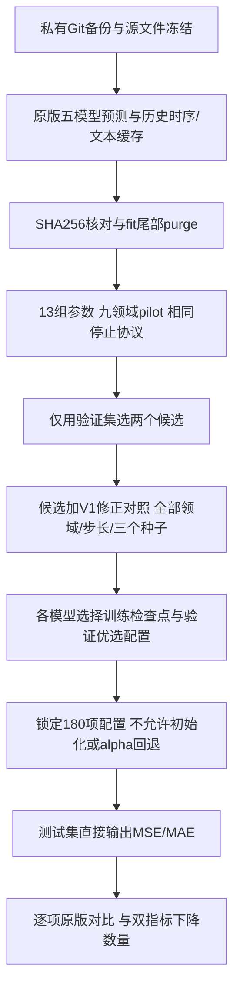

# V1-P2：训练输出的阈值与权重参数实验

## 1. 目标和目前的证据

目标是在5模型×9领域×4预测步长的180项任务中，至少150项同时降低MSE和MAE。150项是目标，不是预设结果。本次只能找到预先列出的候选范围内的验证集优选配置，不能证明全局最优。

V1-P1审核已发现：108项在显示精度下为0变化；85项的三个种子都采用alpha=0；108组拟合中33组选中了epoch=0初始化权重。全部540条种子指标的独立复算没有发现Excel计算错误。原有停止逻辑还会把“没有超过历史最好”与“最近训练趋于稳定”混淆。

因此，先修正实验协议，再做参数实验。仅提高权重、降低回退门槛，会把上述问题继续带入调参。

## 2. 保存和隔离

- 修改前提交：`d40d592`。
- 修改前备份标签：`pre_v1_p2_iteration_20261006`，已推送原私有GitHub仓库。
- 新代码：`plugins/v1_parameter_iteration_20261006/`。
- 原始五个模型仓库、原始底模权重、原V1/V1-P1代码均保持原文件版本。
- 新服务器目录：`/xiliang/LXY/baseline_v1_p2_20261006/`。
- 实验解释器：`/xiliang/LXY/envs/lxy/bin/python`。只在这一环境训练。
- 数据输入来自上轮567个冻结文件，逐一核对SHA256。文本使用已有离线BERT缓存，不访问Hugging Face。

## 3. 思想和必要改动

V1估计条件残差轨迹分布：

`p(未来真实值−底模预测 | 历史时序、当时已经发布的文本、底模预测)`。

历史时序由GRU编码；文本与历史时序按0/1/2滞后对齐；两条条件分布分别表示纯时序证据和时序加语义证据。三角自回归flow建模未来残差的DCT系数依赖，样本重构为未来轨迹，最后用条件均值校正底模预测。这个机制沿用V1，本轮不声称重新实现完整GANF论文。

### 3.1 让语义效用依赖当前底模

V1的分布条件包含底模预测，但语义门控不包含底模预测或模型身份。审核中，108组任务内五个底模的语义门控完全相同。

新候选的门控输入增加底模预测DCT系数和模型身份嵌入，使门控估计“文本能否补充这个底模当前的预测”。门控为：

`gate = sigmoid((gate_logits − gate_threshold) / gate_temperature)`。

门控阈值是**训练与推理中的语义混合阈值**，不是测试后判断是否回退原版的阈值。较大的阈值减少语义分支占比，较小的阈值增加占比。缺失文本时语义门控仍为零，时序残差分支仍参与预测。

这是一次结构修正；参数扫描在修正后的共同基础上进行。原门控、原未平衡损失作为`v1_corrected_control`对照。对照与新基础同时改变了门控条件和损失平衡，二者比较不能独立归因到某一个改动。

### 3.2 平衡五个底模的优化尺度

对每个底模，用purge后的fit子集原预测计算MSE和MAE尺度：

`point_loss = MSE / fit_baseline_MSE + λ_MAE × MAE / fit_baseline_MAE`。

校正正则项也除以该底模fit MSE。这样较大误差底模不因绝对损失较大而自然主导共享模块训练。NLL仍按系数数目归一，不将它误称为按模型平衡。

### 3.3 训练结果直接参与最终预测

- 主结果直接使用`pred = base + history_scale × correction`。
- 不使用外部alpha，不存在alpha=0回退分支。
- epoch=0仅记录初始化诊断，不参与权重选择。
- 最早可选检查点为epoch=8，保存权重时检查参数确实不同于初始化。
- 五个模型仍训练同一模块结构；每个领域、步长、种子联合训练后，按各底模验证误差分别保存其最佳训练检查点。**架构相同，最终检查点可以不同**。
- 不强迫预测必须发生明显变化。如果训练出的校正很小或数值上为零，会如实记录，而不会人为改动预测制造百分比。

这里最小化验证集`max(MSE_ratio, MAE_ratio)`，优先改善两项指标中相对更差的一项。验证指标仍可能变差，测试指标也可能变差；不再用回退隐藏这种结果。

## 4. 13组参数配置

共同基础：hidden=32、DCT系数4（不超过H）、Sobol正负对称样本16、history长度24、单变量OT目标、lag=[0,1,2]、uniform文本时间池化、variance_beta=0、AdamW weight_decay=1e−4、gradient_clip=1。

修正基础默认：模型条件与门控条件打开、损失平衡打开、校正幅度上限1、校正gain初始化sigmoid(0)=0.5、NLL权重0.03、utility权重0.01、MAE权重0.2、正则0.005、语义教师margin=0.05、教师温度0.25、门控阈值0、门控温度1、学习率0.003。

|候选|相对于修正基础的改动|用途|
|---|---|---|
|v1_corrected_control|模型条件关、门控条件关、损失平衡关|只修正训练/输出协议的V1对照|
|conditioned_balanced|无|修正基础|
|amplitude_025|correction_limit=0.25|较弱校正|
|amplitude_200|correction_limit=2|较强校正|
|nll_000|nll_weight=0|分布监督消融，用于判断NLL与点预测是否冲突|
|nll_010|nll_weight=0.1|约3.3倍分布监督|
|nll_030|nll_weight=0.3|10倍分布监督|
|utility_010|utility_weight=0.1|10倍语义效用监督|
|mae_100|mae_weight=1|5倍MAE监督|
|gate_low|gate_threshold=−1|增加语义占比|
|gate_high|gate_threshold=1|降低语义占比|
|teacher_strict|utility_margin=0.2|提高文本带来条件似然收益的教师门槛|
|lr_001|lr=0.001|较低学习率|

除了对照，所有候选均只改变共同基础的一个参数。nll_000是消融，若它获优，说明目前的NLL设计可能不利于点误差，不能据此宣称分布监督有贡献。

## 5. 数据、训练和停止条件

底模和插件输入与原版固定预测对齐；模型间target/history必须完全一致。每个fit子集末尾去掉H−1个origin，防止fit目标区间与holdout目标区间重叠。所有归一化、数据顺序、预测origin、原版预测文件保持一致，本轮不新增反归一化。

**特别限制**：插件使用的是原版数据中的验证段fit/holdout，不是重新获得大规模训练语料。部分小数据任务purge后fit窗口极少，例如Security H=12仅3个origin。重叠窗口也不能当成大量独立样本。因此仅调参未必足以让150项泛化改善，扩大模块也可能更容易过拟合。

所有候选筛选和正式拟合使用相同训练停止协议，而不是用24轮筛选去推断长训练最优：

1. 至少40轮训练，至少8轮后才允许保存最佳检查点。
2. 五个模型各自验证评分连续20轮未产生超过1e−4的改善。
3. ReduceLROnPlateau：factor=0.5、patience=5、min_lr=1e−8；学习率至少降低三次。
4. 最近20轮前10轮与后10轮的平均评分比较：任一模型仍改善超过1e−4时继续训练，防止把从较差位置恢复的曲线误称为平台。
5. 保存每20轮的最后权重、优化器、调度器、随机状态、最佳权重和完整曲线，可恢复训练。
6. 1000轮为安全上限。如果到上限未满足停止条件，写NOT_CONVERGED并停止任务，不输出完整成功标记。

这个协议检验的是**验证集没有继续改善的训练停止条件**，不能证明数学全局收敛。验证误差已经恶化时，也可能触发停止；最终保留的是此前训练得到的验证优选权重。

## 6. 实验步骤与选优

1. 保存并推送修改前版本。
2. 冻结源文件SHA256与13组候选；部署到独立目录。
3. 九个pilot领域各选一个预先固定的H，13配置×9任务×种子2026=117次联合拟合，每次涉及五个底模。
4. 仅按45个验证任务的平均`max(MSE_ratio, MAE_ratio)`排序，选两个新候选；原V1修正对照也进入正式阶段。预先固定pilot：Agriculture6、Climate8、Economy8、Energy36、Environment336、Health24、Security10、SocialGood8、Traffic8。
5. 三配置×九领域×四H×三个种子=324组联合拟合结果。每组保存五个底模各自的训练检查点。其中27组与pilot的数据、种子、参数和完整停止协议相同，直接复用，正式阶段新增297次训练，避免重复消耗资源。
6. 对每个模型/领域/H，只比较三配置在三个种子上的**验证集**指标均值，按最大相对误差较小者选优。同一任务三个种子使用同一个配置，不能分别挑测试集最好的种子。
7. 锁定全部180项的配置和检查点，写TEST_LOCK，才读取本轮test目标。
8. 评估V1-P2与匹配训练协议的V1对照，得到1080条种子指标。V1-P2主结果为180项，逐项给原版MSE/MAE、修改后MSE/MAE、标准差和有符号变化百分比。
9. 统计真正双指标下降项数，低于150也保留全部结果，不能按测试结果重选本轮参数。



## 7. 结果口径

`变化百分比 = (修改后指标 − 原版指标) / 原版指标 × 100%`。

负数表示误差下降；正数表示误差上升。双指标改善计数要求MSE和MAE变化均小于−0.00001%，排除float32舍入噪声。每项修改指标取三个插件种子的均值；原始底模预测不因插件种子变化。不跨领域或步长平均MSE当作主要效果。

输出：`results_180.csv`、`RESULTS_180.json`、`test_seed_results.csv`、`matched_control_180.csv`、`V1-P2参数实验结果.md`，以及各候选训练曲线、检查点和验证选优依据。

由于旧测试集已在多轮迭代中被查看，这轮是开发性实验，即使本轮严格不按测试选参，也不能声称整个研究过程一直保持测试盲态。最终论文需要新的独立测试区间或外部数据验证。

## 8. 运行和资源

部署工具只在`/xiliang/LXY/`新增文件；GPU优先空闲卡，否则仅选至少8GB空余的卡。单进程显存限制为5%，4个CPU线程，不终止其他进程。

服务器中的核心运行命令：

```bash
cd /xiliang/LXY/baseline_v1_p2_20261006
CUDA_VISIBLE_DEVICES=<部署工具选定GPU编号> V1_P2_GPU=<同一编号> \
HF_HUB_OFFLINE=1 TRANSFORMERS_OFFLINE=1 \
/xiliang/LXY/envs/lxy/bin/python -u plugins/v1_parameter_iteration_20261006/run.py
```

实际启动由`deploy.py`记录PID、代码提交、GPU与日志路径，后台运行，不需要保持聊天等待。若发生报错或安全上限未收敛，保留日志与恢复状态，明确标记未完成。

本地`manage.py`可以在首次SSH不可达时后台每60秒重试，最多等待6小时；网络恢复后自动部署并启动。它只在内存保留通过匿名管道传入的密码，不保存凭据文件。任务完成后自动下载、逐条复算1080条种子指标、验证180项均值、保存报告并提交私有GitHub。训练报错时保存异常日志并停止，不把错误当成完成。
